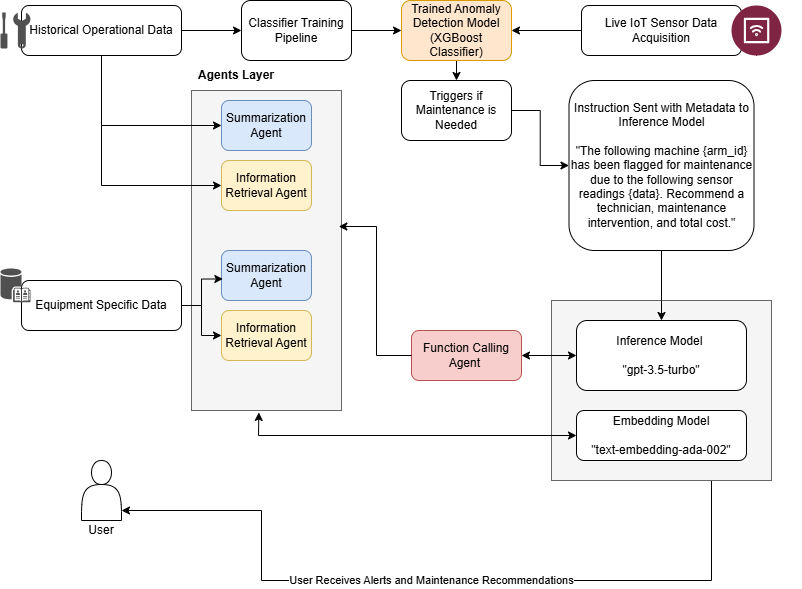
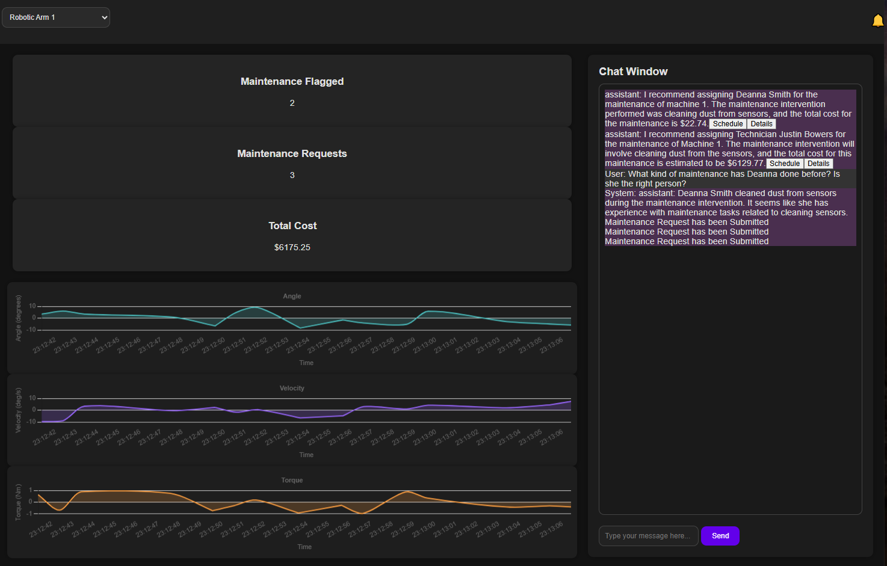

# PMR-Agents: Predictive Maintenance RAG Agent

PMR-Agents is a proof-of-concept application designed to demonstrate a base architecture that integrates streaming sensor data, multiple pipeline components, and an agentic retrieval-augmented generation (RAG) system. The application targets equipment maintenance by delivering actionable recommendations to supervisors based on real-time IoT sensor data and historical maintenance records.

---

## Table of Contents

- [Overview](#overview)
- [Key Features](#key-features)
- [Architecture & Application Flow](#architecture--application-flow)
- [Terminology](#terminology)
- [Installation & Setup](#installation--setup)
- [Usage](#usage)
- [Disclaimer & Future Enhancements](#disclaimer--future-enhancements)
- [License](#license)

---

## Overview

PMR-Agents is built as a sample application to illustrate how various modern technologies can be orchestrated to support predictive maintenance. The system streams synthetic sensor data from multiple robotic arms, processes the data through an XGBoost classifier to flag anomalies, and then leverages agentic RAG techniques to query documents (such as equipment manuals and maintenance records) and generate maintenance recommendations through a chat interface.

---

## Key Features

- **Real-Time Data Streaming:** Sensor data is simulated for multiple robotic arms.
- **Anomaly Detection:** Uses an XGBoost classifier trained on historical data to predict when maintenance is required.
- **Agentic RAG System:** Integrates OpenAI’s API to build agents that can call tools, retrieve and summarize document data, and generate maintenance recommendations.
- **Interactive Chat Interface:** Supervisors can interact with the system, ask follow-up questions (e.g., "Are you sure you're recommending the right technician?"), and get deeper insights.
- **Cost Tracking:** Enables tracking of maintenance costs through an integrated scheduling component.
- **Modular Pipeline Components:** Separates sensor data streaming, anomaly detection, and document query tools for clarity and ease of extension.

---

## Architecture & Application Flow

The following is a high-level description of the application flow (refer to the solution architecture diagram):

  
*Figure: Simple Solution Architecture of the application.*

1. **Sensor Data Generation:**  
   Synthetic sensor data (joint angle, velocity, torque) is generated continuously for multiple robotic arms.

2. **Anomaly Detection:**  
   An XGBoost classifier processes the sensor data to detect anomalies indicating potential maintenance needs.

3. **Agentic RAG Processing:**  
   Upon detecting an anomaly, an agent queries multiple documents (e.g., equipment manuals, historical maintenance records) using vector and summary query tools.  
   - **Tool Calling Agents:** These components use OpenAI’s API to extract relevant information and summarize it.
   - **Agent:** Coordinates tool calls and integrates results into actionable maintenance recommendations.

4. **Recommendation Delivery:**  
   Recommendations, including technician suggestions, cost estimates, and intervention details, are presented via a chat interface.  
   Supervisors can further inquire about or challenge the recommendations, prompting additional context retrieval.

5. **Cost Tracking & Scheduling:**  
   Maintenance requests are tracked, and the total cost is updated accordingly.

  
*Figure: Screenshot of the PMR-Agents chat interface showcasing real-time recommendations and data streams.*

---

## Terminology

- **Agentic RAG:**  
  An advanced retrieval-augmented generation system where agents autonomously call tools (like document search or summarization functions) to gather and synthesize information for generating responses.

- **Tool & Function Calling:**  
  The mechanism by which the system’s agents execute specific functions (e.g., querying a vector store or summarizing text) to interact with data sources.

- **Agents:**  
  Autonomous components powered by OpenAI’s models that orchestrate tool calls to generate contextually relevant responses and recommendations.

- **Function Calling Agent Worker:**  
  A specialized worker that leverages both the OpenAI API and predefined function tools to process user queries and produce maintenance insights.

---

## Installation & Setup

1. **Clone the Repository:**
```bash
git clone [https://github.com/your-repo/PMR-Agents.git](https://github.com/eduand-alvarez/pmr_agents.git)
cd pmr_agents
```
   
2. Create & Activate a Virtual Environment:

```bash
python -m venv venv
source venv/bin/activate  # On Windows, use `venv\Scripts\activate`
```

3. Install Dependencies:

```bash
pip install -r requirements.txt
```

4. Configure Environment Variables:

You can paste your OpenAI key directly into the main_openai.py script but that could lead to security issues with your key. 

Best practices would be to create a .env file in the project root and reference that from the script. 

Important:
Ensure you manage your OpenAI API key securely. Do not hard-code it directly in the codebase or expose it in public repositories.

5. Prepare the Model:

Place your pre-trained XGBoost model file (e.g., xgboost_model.json) in the appropriate directory (../ml/ as referenced in the code). There's already a sample model trained from the synth data - /ml/xgboost_model.json

6. Run the Application

```bash
cd project
python main_openai.py
```

7 Access the Application:

Open your browser and navigate to http://localhost:8000 to interact with the chat interface and view sensor data streams.

Interacting with the Chat Interface:

- Enter queries or questions regarding equipment maintenance.
- Review the recommendations, which include technician suggestions, cost estimates, and additional details.
- Use the provided buttons to schedule maintenance or view deeper insights into the recommendations.

Disclaimer & Future Enhancements
Proof-of-Concept:
PMR-Agents is a sample application intended for demonstration purposes only. It serves as a base architecture for integrating sensor data streaming, machine learning anomaly detection, and agentic RAG for predictive maintenance.
Note: All data used in the application is synthetic.

Intended Use & Limitations:
The current implementation is not production-ready. It is provided “as is” without warranties or guarantees. Future production-ready versions should include robust data management, security measures, and integration with real IoT devices and production-grade ML models.

Next Steps for Production:

Integrate with real sensor data and historical maintenance databases.
Enhance the ML model with continuous training and validation on real-world data.
Implement additional security and error-handling measures.
Expand the agentic capabilities with more refined tool integrations and user feedback loops.
